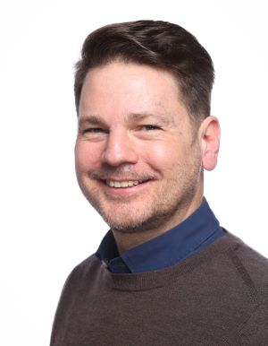
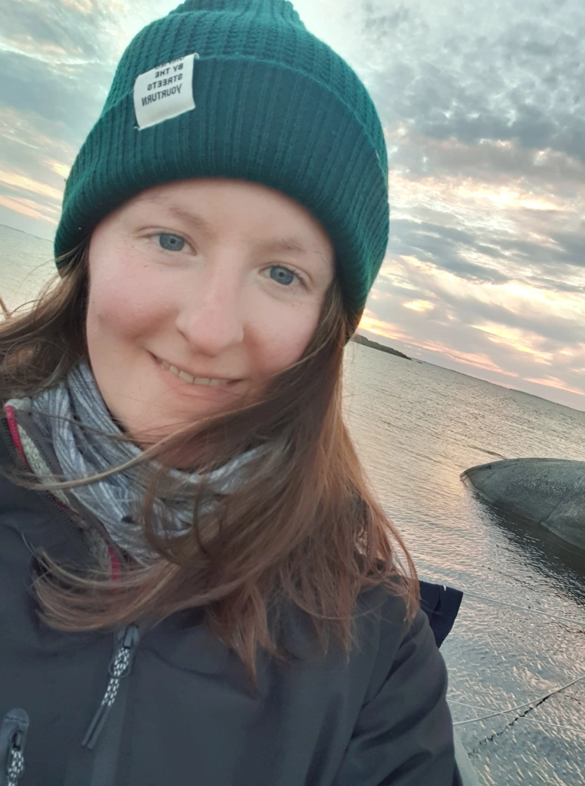
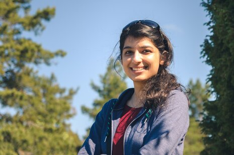
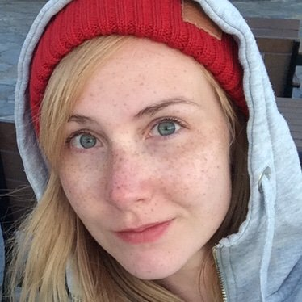

  

**Micah Dunthorn, President**  
Natural History Museum  
University of Oslo  
Sars gate 1, Lids hus, Oslo, Norway  
*micah.dunthorn@nhm.uio.no*  

  

**Courtney Stairs, Vice President**  
Biology Department  
Lund University  
Sölvegatan 35, Lund, Sweden  
*courtney.stairs@biol.lu.se*  

**Mahwash Jamy, Early Career Representative**  
Department of Aquatic Sciences and Assessment  
Swedish University of Agricultural Sciences  
Lennart Hjelms väg 9, Uppsala, Sweden  
*mahwash.jamy@slu.se*  

**Anna-Lotta Hiillos, Early Career Representative**  
Natural History Museum  
University of Oslo  
Sars gate 1, Colletts hus, Oslo, Norway  
*a.l.hiillos@nhm.uio.no*  
