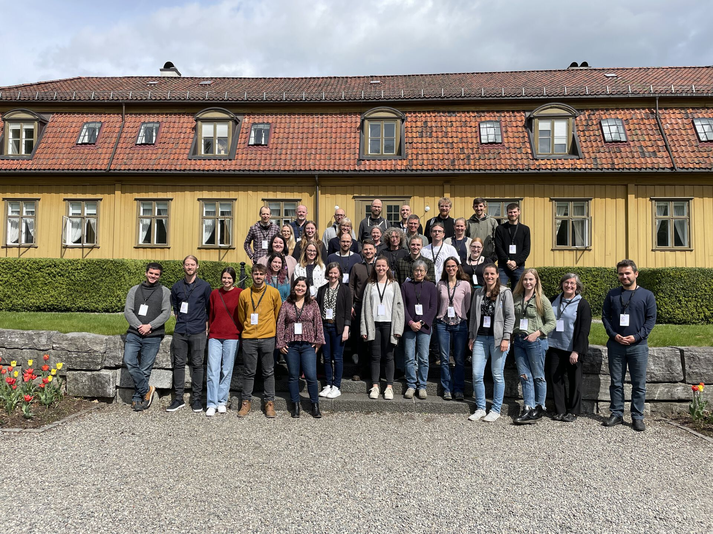
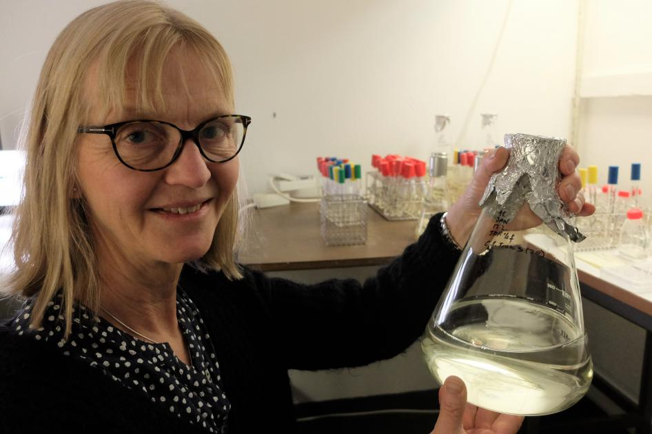
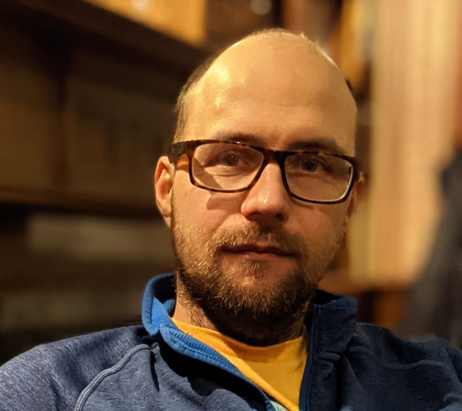
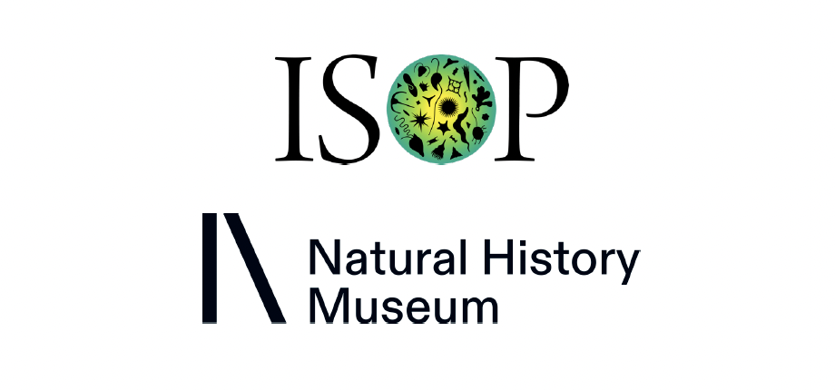

## About the meeting

**1st Protistology Nordics Meeting | Oslo**  
**10-11 May 2022**

The first edition of the Protistology Nordcis Meeting took place in Oslo on 10-11 May 2022. It featured 22 presented talks, and six posters. The meeting logo was designed by Corey Holt (University of British Columbia).    

The website for the meeting can be found [HERE!](https://www.nhm.uio.no/english/research/events/conferences/pnmeeting/).

## Program 
***The final meeting programme is available for download [HERE](PiN_meeting_2022_Oslo.pdf)!***

## Invited Speakers

Bente Edvardsen  
Department of Biosciences  
University of Oslo   
 

Bente Edvardsen  
Department of Biosciences  
University of Oslo   

## Organisation

Micah Dunthorn. University of Oslo  
Courtey Stairs. Lund University  
Fabien Burki. Uppsala University    

## Sponsors  

The International Society of Protistologists (ISOP) supported Protistology Nordics 2022 by providing funds for travel/housing awards, talk/poster prises, and for general running costs. Talks were streamed using ISOP’s Zoom license.

The Natural History Museum at the University of Oslo supported Protistology Nordics 2022 by providing the meeting rooms, and by providing free access to the Zoology and Geology museums.  

  

