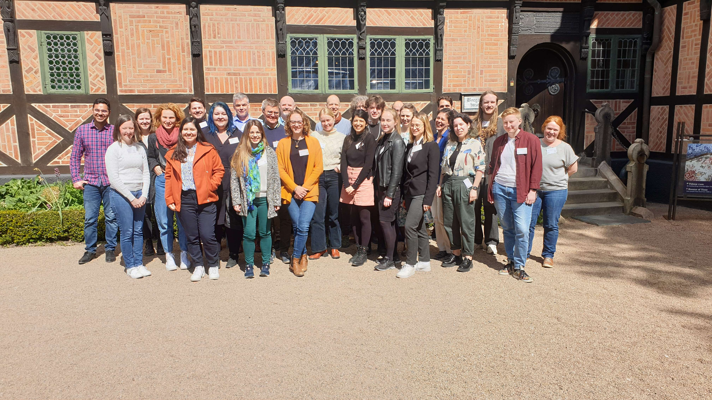
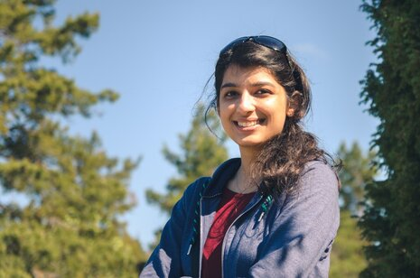

## About the meeting

**2nd Protistology Nordics Meeting | Lund**  
**2-3 May 2023**

The second edition of the Protistology Nordcis Meeting took place in Lund on 2-3 May 2023. It was joined by 35 enthusiastic participants.  

A blog post about the meeting can be found [HERE!](https://thelabupstairs.online/outreach/).

## Program 
***The final meeting programme is available for download [HERE](PiN_meeting_2023_Lund.pdf)!***

## Invited Speaker

 
Mahwash Jamy   
Department of Aquatic Sciences and Assessment  
Swedish University of Agricultural Sciences    
Sweden  
 
## Student awards

*Best oral presentation*  
Yash Pardasani
Uppsala University

*Best flash presentation*  
Nina Pohl  
Uppsala University  

## Organisation

Courtney Stairs. Lund University   
Sofia Paraskevopoulou. Lund University  
Mara Vizitiu. Lund University    
Micah Dunthorn. University of Oslo  
Fabien Burki. Uppsala University    

