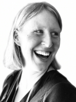
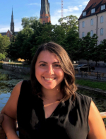
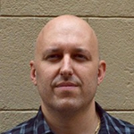
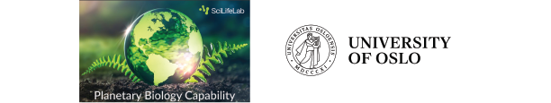

## About the meeting

**3rd Protistology Nordics Meeting | Uppsala**  
**2-3 May 2024**

We are excited to announce that Protistology Nordics 2024 will be held in Uppsala, providing an opportunity for scientists in Nordic countries to come together and showcase their research on the genetics, cell biology, ecology, and evolution of protists.

The meeting is designed to facilitate vibrant discussions about the latest research in protistology, social interaction, and networking with fellow participants. It is scheduled for May 2nd and 3rd in Uppsala, featuring a workshop on May 2nd at the Evolutionary Biology Centre (EBC), Uppsala, followed by a dinner for all participants.

This meeting stems from the prior Protistology Nordics meetings held in Oslo (2022) and Lund (2023).

## Registration and Abstract Submission

**Register [HERE](https://forms.gle/fEGVEzsnXeyvSkaP6)!**

Registration and Abstract Submission Deadline: 25 March, 2024  
Selected abstracts/Participants Will Be Notified By: 2 April, 2024  

## Venue  

Talks, lunches, and workshop will take place at  

Evolutionsbiologiskt centrum (EBC)  
Uppsala University   
Norbyvägen 18  
752 36 Uppsala  
Sweden  

<iframe src="https://www.google.com/maps/embed?pb=!1m18!1m12!1m3!1d12092.362362312388!2d17.60854873412844!3d59.85234170121815!2m3!1f0!2f0!3f0!3m2!1i1024!2i768!4f13.1!3m3!1m2!1s0x465fcbec38f7fc99%3A0x7c4274b1ef899498!2sNorbyv%C3%A4gen%2018%2C%20752%2036%20Uppsala%2C%20Sweden!5e0!3m2!1sen!2sfr!4v1706566121528!5m2!1sen!2sfr" width="600" height="300" style="border:0;" allowfullscreen="" loading="lazy" referrerpolicy="no-referrer-when-downgrade"></iframe>

Dinner on 2nd May will take place at  

William's Pub  
Åsgränd 5  
753 10 Uppsala  

<iframe src="https://www.google.com/maps/embed?pb=!1m18!1m12!1m3!1d2003.5398533493592!2d17.625653094198192!3d59.856781703909846!2m3!1f0!2f0!3f0!3m2!1i1024!2i768!4f13.1!3m3!1m2!1s0x465fcbf164e6c4ad%3A0xd53d8adf9b1961a7!2sWilliams%20Pub!5e0!3m2!1sen!2sfr!4v1706566331847!5m2!1sen!2sfr" width="600" height="300" style="border:0;" allowfullscreen="" loading="lazy" referrerpolicy="no-referrer-when-downgrade"></iframe>

### Places to stay

Nearby hotels and hostels can be found [here](https://www.booking.com/searchresults.en-gb.html?ss=Uppsala&ssne=Uppsala&ssne_untouched=Uppsala&label=gen173nr-1FCAEoggI46AdIM1gEaKoBiAEBmAEJuAEHyAEN2AEB6AEB-AENiAIBqAIDuAK3nKOQBsACAdICJDI3ZDJjZDhjLTAyZWMtNDlkNi04YzQwLWMyMWQ1ZWZlZTA3YdgCBuACAQ&sid=1cb6a04bacbea7250c44b05f574dc713&aid=304142&lang=en-gb&sb=1&src_elem=sb&src=index&dest_id=-2532413&dest_type=city&checkin=2024-05-01&checkout=2024-05-03&group_adults=1&no_rooms=1&group_children=0).

Please note that we are *not* providing accommodations to the meeting.  

## Program 

**2 May 2024**   
*Workshop for Early Career Researchers, and Pub night*   
A workshop for Masters students, PhD students, and postdocs!  

  
Preliminary schedule</i>

| Time               | Event                                                                            |
|--------------------|----------------------------------------------------------------------------------|
| 9:00-9:30          | Registration                                                                     |
| 9:30-10:30         | Introductions                                                                    |
| 10:30-11:00        | Fika (coffee + snacks)                                                           |
| 11:00-12:00        | Talk by Ramiro Logares on population genomics of protists using metagenomics     |
| 12:00-13:00        | Lunch                                                                            |
| 13:00-14:30        | Mini-workshop on metagenomics led by Jennah Dharamshi                            |
| 14:30-15:00        | Fika (coffee + snacks)                                                           |
| 15:00-17:00        | A presentation of infrastructure in Sweden for genomics, proteomics, and imaging |
| 17:00-18:00        | Free time                                                                        |
| 18:00 -            | Pub night (William's Pub)                                                        |

**3 May 2024**   
*Symposium on Protist Cell Biology, Ecology, and Evolution*

  
Preliminary schedule</i>
 

| Time               | Event                                           |
|--------------------|-------------------------------------------------|
| 8:30-9:00          | Registration                                    |
| 9:00-9:15          | Welcome address                                 |
| 9:15-10:00         | Plenary talk by Elisabeth Hehenberger           |
| 10:00-10:30        | Fika (coffee + snacks)                          |
| 10:30-12:00        | Contributed talks                               |
| 12:00-13:00        | Lunch                                           |
| 13:00-14:30        | Contributed talks                               |
| 14:30-15:00        | Fika (coffee + snacks)                          |
| 15:00-16:30        | Contributed talks                               |
| 16:45-17:00        | Concluding remarks and best student talk prizes |

## Invited Speakers and Instructors

*Plenary speaker*  
Elisabeth Hehenberger   
Institute of Parasitology   
Biology Centre CAS   
Czech Republic   

  

*Instructor, early career researcher workshop*  
Jennah Dharamshi   
Department of Organismal Biology   
Uppsala University     
Sweden   

  

*Invited speaker, early career researcher workshop*  
Ramiro Logares  
Ecology of Marine Microorganisms Research group   
Institute of Marine Sciences   
Spain   

## Organisation

Mahwash Jamy. Swedish University of Agricultural Sciences  
Jennah Dharamshi. Uppsala University  
Micah Dunthorn. University of Oslo    
Fabien Burki. Uppsala University    
Courtney Stairs. Lund University  

## Sponsors

The event has been supported by UiO:Life Science and SciLifeLab Planetary Biology.

  
